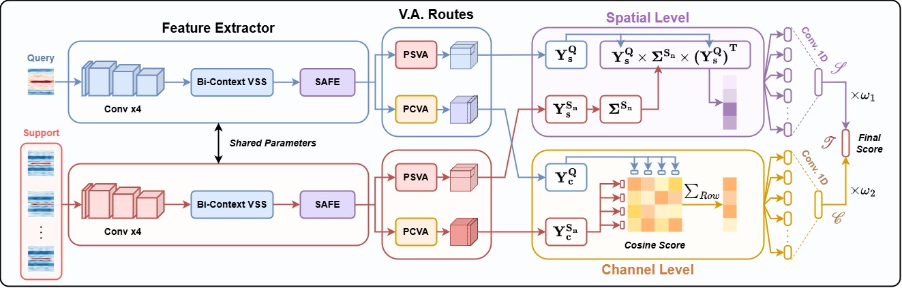
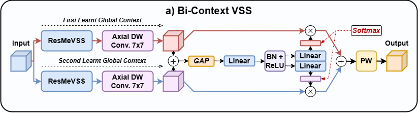
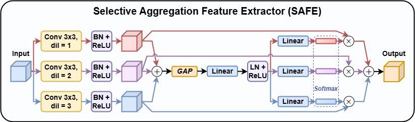
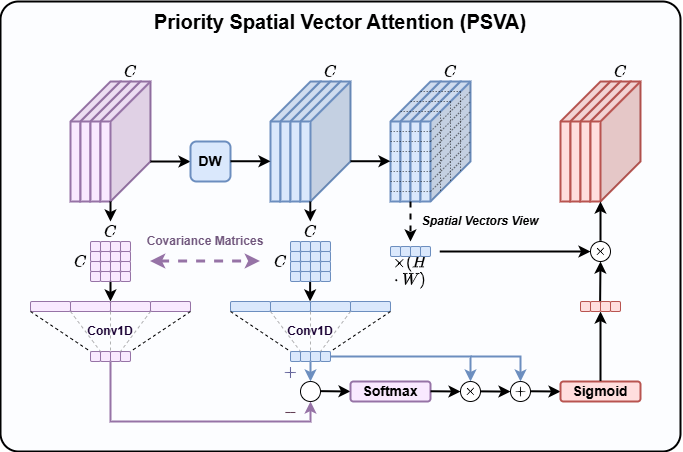
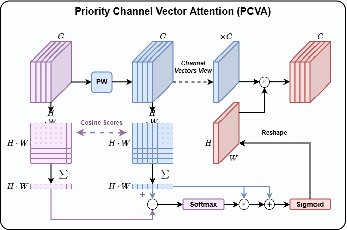
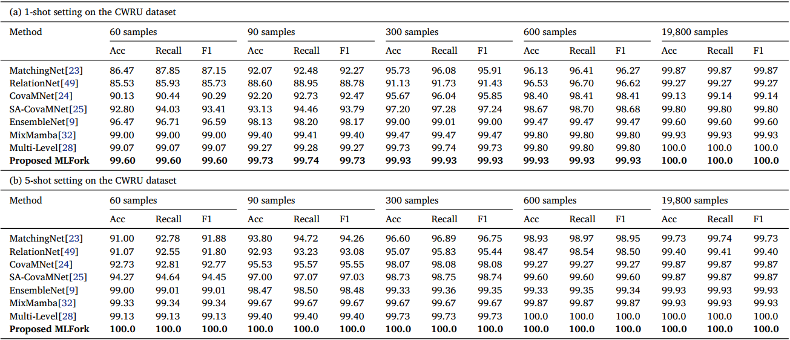
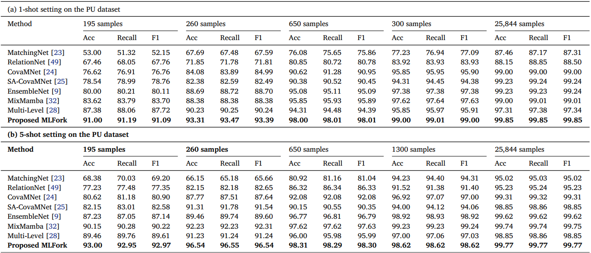

# 🍴MLFork: Bearing fault diagnosis via Mamba-powered few-shot learning model with multi-level architecture enhanced by spatial-wise and channel-wise local vector attention

[Link to paper](https://doi.org/10.1016/j.neucom.2025.131518

Main Model


Feature Extractor



Vector Attention



## Prerequisites
- Python 3
- Linux
- Pytorch 0.4+
- GPU + CUDA CuDNN
## Dataset
In this paper, we utilize 2 datasets: [CWRU](https://engineering.case.edu/bearingdatacenter) and [PU](https://mb.uni-paderborn.de/kat/forschung/kat-datacenter/bearing-datacenter/data-sets-and-download). 

## Getting Started
- Installation
``` bash
git clone https://github.com/thzhere/MLFork.git
```
- Training for 1 shot
``` bash
python train_1shot.py --dataset 'CWRU' --training_samples_CWRU 30 --training_samples_PDB 195 --model_name 'Net'
```
- Testing for 1 shot
```bash
python test_1shot.py --dataset 'CWRU' --best_weight 'PATH TO BEST WEIGHT'
```
- Training for 5 shot
``` bash
python train_5shot.py --dataset 'CWRU' --training_samples_CWRU 60 --training_samples_PDB 300 --model_name 'Net'
```
- Testing for 5 shot
```bash
python test_5shot.py --dataset 'CWRU' --best_weight 'PATH TO BEST WEIGHT'
```
- Result
1. CWRU dataset

1. PU dataset


## Contact
Please feel free to contact me via email thai.nd232543@sis.hust.edu.vn or duythainsl@gmail.com if you need anything related to this repo!
## Citation
If you feel this code is useful, please give us 1 ⭐ and cite our paper.
```bash
@article{nguyen2025mlfork,
  title={MLFork: Bearing fault diagnosis via Mamba-powered few-shot learning model with multi-level architecture enhanced by spatial-wise and channel-wise local vector attention},
  author={Nguyen, Duy-Thai and Tran, Thi-Thao and Pham, Van-Truong and others},
  journal={Neurocomputing},
  pages={131518},
  year={2025},
  publisher={Elsevier}
}
```
